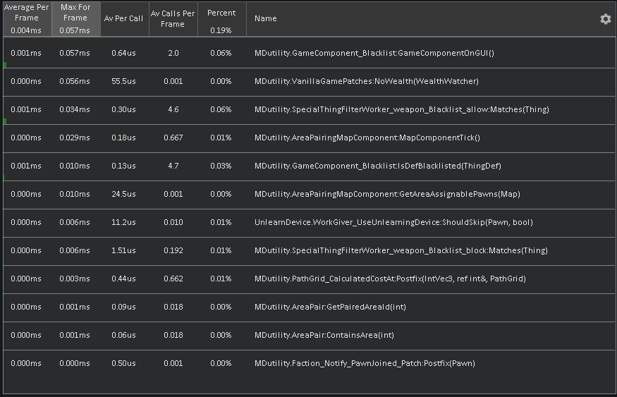
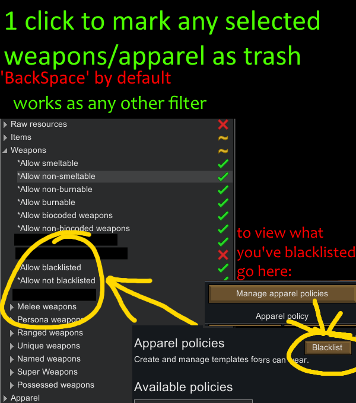
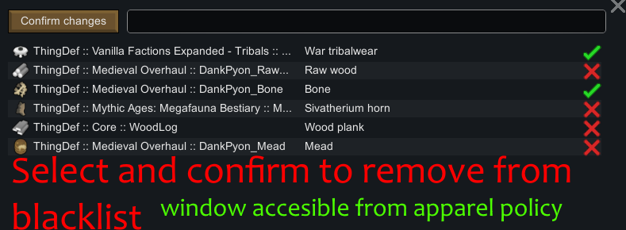
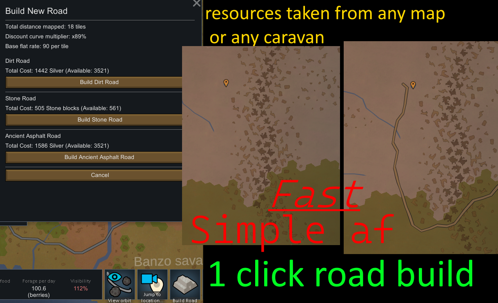
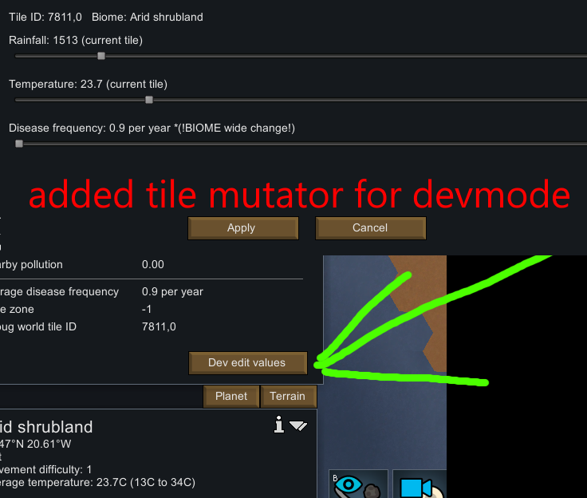

# MdRuz_utilities
Rimworld 1.6/1.5 mod  
TL;DR:  
automates some tasks, such as:  
-medicine switching(on infection),  
-auto zone switch (if danger on map),  
-sets Nodrugs policy for colonists >18.  
Introduces 'Bill' persistence if building is rebuilt it will keep its bills intact.  
-apart from that, the full release version revamps almost all psycasts and has some tweaks.

more info:  
-**Simple, easy to use, no hassle - Road builder**  
1 click solution, resources in -> Road out  
cheap and accessible whenever from worldview gizmo.  
(resources taken from any player map or any caravan. instantly)  

-**weapon/apparel blacklist filter**  
1 Click solution!  
Works for all Stockpiles, Bills, smelters, recipes, apparel Policy!  
simply select some weapon/apparel(can be multiple) -> press 'BackSpace' ??? DONE!  
press 'SHIFT' + 'Backspace' to reverse.  
it will automatically update your Apparel policy. ('Anything' 'Soldier' 'General')  
Keybind can be changed in game settings -> controls.  
You can also open the entire blacklist at anytime by clicking on ->Assign ->Manage apparel policies ->Blacklist (top right)  
blacklist is saved PER game.  
'Not blacklisted' essentially acts as a whitelist. (Filtering in RimWorld is Additive!)  
 
Example use-case 1:  
raiders loot(trash) management:  
create destroy/smelt bill in the smelter and tick off 'Allow not blacklisted', keep all weapons/apparel checked.  
add to the blacklist at anytime with 1 click, whatever you select.  
works automatically!  
  
Example use-case 2:  
use blacklist As 'Favorites' instead.  
create stockpile with only the hand picked stuff without searching for each individual item.  
  
-**brought back noCollision** togglable in settings. Drafted pawns will be able to clip through each other when attacking an enemy.  
(wip feature. turn off if encountering any issues)  

-**bills inside production buildings will never be lost if that building got destroyed by raiders**.  
(enable autorebuild in the game UI -> bottom right (hammer icon))  
when any production building is rebuilt it will keep its original Bills/recipes  

-**deepscanner will now prioritize discovering ores around itself in a 80x80 grid**.  
works with multiple scanners.  
however if the spot for ore vein is somehow incorrect or already occupied it will fall back to vanilla which has no range limit.  
-**new gizmo for Ground Penetration Scanner**, which will clear all scanned deeppackets of ore.  
has a confirmation dialog in case you missclick  

-**adds a button to AREA, manage area window, which will**:  
assign that area to a pair of 2.  
automatically switch between chosen 2 areas when any ENEMIES are present on the map.  
it only switches the area of pawns which are already assigned between the area pairing.  
(so if you have more than 2 areas assigned, colonists that are not assigned either or, of those 2 areas wont be changed.)  
now also works for zonable animals.  

-**psycasts Gizmos (buttons) now automatically switch their order so that the available come first**.  
this makes it possible to cast them repeatedly using a hotkey.  

-**automatically switch to 'industrial medicine' on new disease/infection**  
when immunity is developed, switches back to 'doctor care but no medicine'  
this function is performed only once, so that the player can switch their preference back to whatever at anytime.  

-**colonists inside caskets are not counted for colony wealth** calculation.  
should support any building where a pawn can go into  

-**slaves counted as 50% of pawn value**. (instead of vanilla 75%)   

-**new ritual reward which replaces Random Recruit. Taunt enemies**. 60% chance of triggering a very small raid to attack your colony.  

-**new spot which allows deLeveling skills from specific pawns**  
why?  
colonist wealth is calculated by how high their skills are(vanilla). in turn you can control the wealth of each colonist by making them dumber. haha  
maybe you have crafting specialist, and the only skills he needs is shooting / crafting?  
turn your slaves into inexperienced fighters to lower their threat?  
lower your colony wealth = game throws smaller raids  
find in 'Misc' tab, place it anywhere, configure it using gizmo, it's simple  

included in full release:  
-sets drug policy to "No drugs" for any colonist below 18. requires that at least one policy has "No drugs" label.  
updates the policy on pawn birthday or pawn faction change. example: 1yr old becomes 2yr old, age <18 prisoner gets recruited.  
does not update policy when spawning <18 in dev mode or when they just appear. (optimization)  

-betterment of psycasts  

